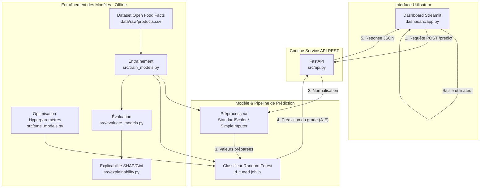

# NutriPredict — Classification multiclasse du Nutri-Score

Prédiction automatique du Nutri-Score (A à E) d'un produit alimentaire à partir de ses valeurs
nutritionnelles pour 100 g, sur la base du jeu de données Open Food Facts (80 000 produits).

Projet réalisé en binôme dans le cadre du M1 Data Science – EFREI Paris.  
**Candidats :** Samy HALIT ([@Sglinggling](https://github.com/Sglinggling)) & Ananda CASSINI ([@ananda3cassini](https://github.com/ananda3cassini))

<p align="center">
  
  
  
  
  
  
</p>

---

## Problématique métier

Un fabricant qui formule un nouveau produit ne connaît pas son Nutri-Score définitif avant
l'homologation officielle. Ce projet entraîne un classifieur capable de **prédire le grade
(A–E) à partir des seules variables nutritionnelles** (énergie, lipides, graisses saturées,
glucides, sucres, protéines, sel, fibres) afin d'orienter les choix de formulation dès la
phase de conception.

---

## Structure du projet

```
project/
├── data/
│   ├── raw/          # dump Open Food Facts (git-ignoré)
│   └── processed/    # données nettoyées (git-ignoré)
├── notebooks/
│   └── 01_eda.ipynb  # exploration, nettoyage, analyse exploratoire
├── src/
│   ├── config.py         # constantes centrales (chemins, features, seeds)
│   ├── utils.py          # chargement du dump OFF
│   ├── preprocessing.py  # nettoyage, encodage, pipeline
│   ├── train_models.py   # entraînement des 5 modèles
│   ├── evaluate_models.py# métriques, matrices de confusion, CV
│   ├── explainability.py # importance des variables, SHAP
│   ├── tune_models.py    # optimisation d'hyperparamètres (RandomizedSearchCV)
│   └── api.py            # API REST FastAPI
├── models/           # modèles sérialisés joblib (git-ignoré)
├── dashboard/
│   └── app.py        # dashboard Streamlit interactif
├── requirements.txt
└── README.md
```

---

## Architecture du Projet



---

## Installation et lancement

### 1. Prérequis

**Python 3.12.7** est requis. TensorFlow (utilisé pour le MLP) ne supporte pas Python 3.13+.  
Utiliser [pyenv](https://github.com/pyenv/pyenv) pour installer et utiliser exactement cette version.

Toutes les commandes ci-dessous s'exécutent depuis le dossier **`project/`**.

### 2. Télécharger le dataset Open Food Facts

```bash
# Depuis project/
curl -L "https://static.openfoodfacts.org/data/en.openfoodfacts.org.products.csv.gz" \
  -o data/raw/en.openfoodfacts.org.products.csv.gz

gunzip data/raw/en.openfoodfacts.org.products.csv.gz
```

Le fichier décompressé doit se trouver à `data/raw/en.openfoodfacts.org.products.csv`.

### 3. Environnement virtuel et dépendances

Sur les Mac récents, `python -m venv` crée un venv en Python 3.13+ par défaut.
Appeler le binaire pyenv explicitement garantit Python 3.12.7 :

```bash
# Depuis project/
pyenv install 3.12.7
~/.pyenv/versions/3.12.7/bin/python -m venv .venv
source .venv/bin/activate        # macOS / Linux
# .venv\Scripts\activate         # Windows
```

**Vérifiez la version avant de continuer, sinon TensorFlow échouera (pas de wheel pour Python 3.13+).**

```bash
python --version   # DOIT afficher Python 3.12.7 — sinon supprimez .venv et recommencez
```

```bash
pip install -r requirements.txt
```

### 4. Exploration des données (notebook EDA)

Ouvrir `notebooks/01_eda.ipynb` dans VS Code, sélectionner le kernel `.venv`, puis
**Run All**. Le notebook génère les figures dans `notebooks/figures/`.

### 5. Entraîner les modèles *(OBLIGATOIRE — les fichiers `.joblib` et `models/` sont git-ignorés)*

Les modèles sérialisés ne sont pas inclus dans le dépôt. Cette étape est **obligatoire**
avant de lancer le dashboard ou l'API. Les scripts génèrent également les figures dans
`notebooks/figures/` utilisées par le dashboard.

Exécuter dans l'ordre depuis `project/` :

```bash
python -m src.train_models       # génère les .joblib et le preprocessor dans models/
python -m src.evaluate_models    # génère comparison_results.csv et les matrices de confusion
python -m src.explainability     # génère les figures SHAP dans notebooks/figures/
```

```bash
python -m src.tune_models        # optionnel — optimisation RF et Gradient Boosting (long)
```

### 6. Lancer le dashboard

```bash
streamlit run dashboard/app.py
```

Accès sur **http://localhost:8501**

### 7. Lancer l'API REST

```bash
uvicorn src.api:app --port 8000
```

Documentation Swagger interactive : **http://localhost:8000/docs**

### 8. Mode simulation complet (dashboard + API)

L'onglet **Simulation** du dashboard appelle l'API pour les prédictions.
Lancer les deux services en parallèle depuis `project/` :

```bash
# Terminal 1
uvicorn src.api:app --port 8000

# Terminal 2
streamlit run dashboard/app.py
```

Le dashboard détecte automatiquement si l'API répond (indicateur vert).
Si l'API est absente, il bascule en **mode local** et charge le modèle directement.

---

## Modèles et résultats

Tous les modèles sont évalués sur le même test set (20 % de 80 000 produits, split stratifié).

| Modèle               | F1-macro |
|----------------------|----------|
| Random Forest        | **0.9587** |
| MLP (Keras)          | 0.9230   |
| Gradient Boosting    | 0.9106   |
| SVM RBF              | 0.8741   |
| Régression Logistique| 0.7327   |

**Modèle retenu : Random Forest**  
Meilleur F1-macro sur le test set, avec un temps d'inférence inférieur à la milliseconde
par produit et des importances de variables directement interprétables (Gini, permutation,
SHAP). L'optimisation par `RandomizedSearchCV` améliore encore le score (F1 = 0.9631).

---

## Méthodologie

### Pipeline anti-leakage

L'imputation (médiane) et la normalisation (`StandardScaler`) sont encapsulées dans un
`sklearn.Pipeline` ajusté uniquement sur `X_train`. Aucune statistique des données de test
ne fuite dans l'entraînement. Les bornes physiques (ex. énergie ≤ 3 700 kJ/100 g) sont
appliquées de façon déterministe avant le split — elles relèvent du domaine métier, pas des
données.

### Gestion du déséquilibre des classes

Le Random Forest est entraîné avec `class_weight='balanced'` pour compenser la
surreprésentation des grades D et E dans Open Food Facts.

### Interprétabilité

Trois méthodes d'analyse sont combinées en synthèse :

- **Importance Gini** — native Random Forest, coût nul à l'inférence.
- **Permutation importance** — indépendante du modèle, évaluée sur la métrique F1-macro.
- **SHAP** — `TreeExplainer` sur 2 000 exemples de test, beeswarm plot multiclasse.
