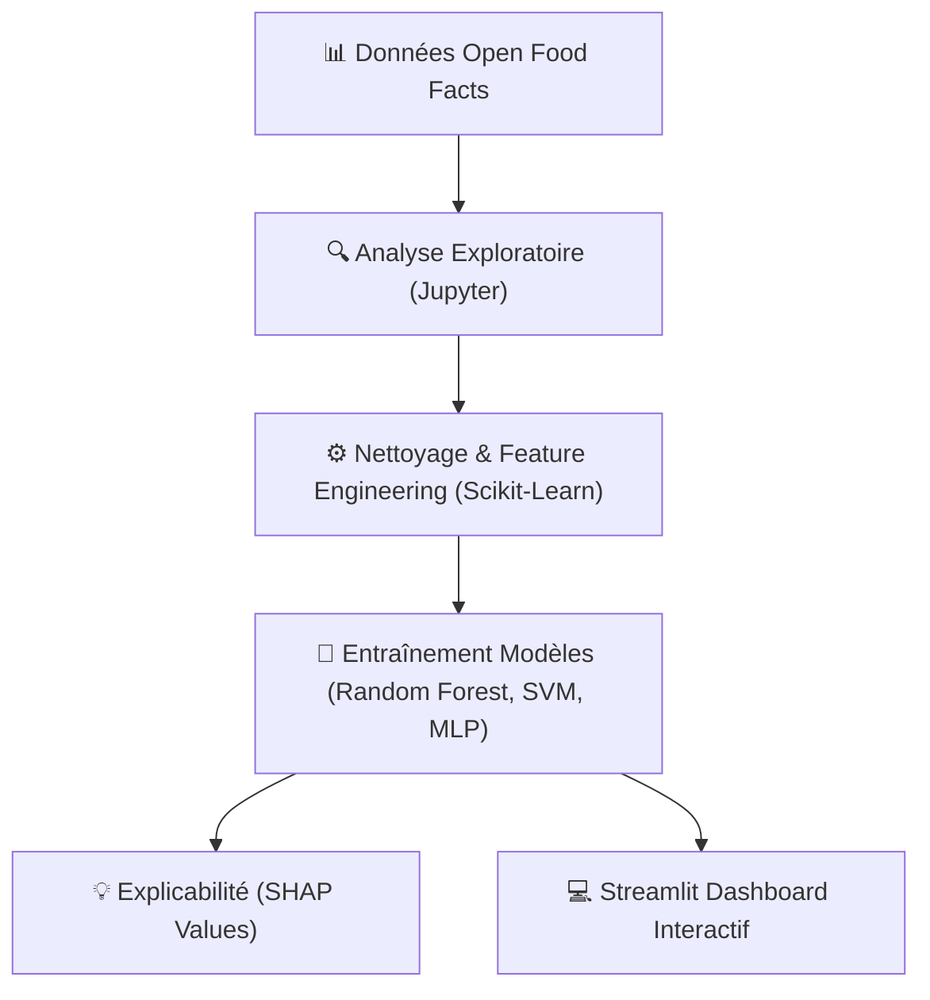

# 🥗 NutriPredict — Classification du Nutri-Score

NutriPredict est une application d'apprentissage automatique de classification multiclasse pour prédire automatiquement la note Nutri-Score (A à E) d'un aliment selon ses apports nutritionnels pour 100g.

---

## 🏗️ Pipeline de Machine Learning

## 📂 Fichiers du Projet
- `notebooks/01_eda.ipynb` : Analyse descriptive des variables et corrélations nutritionnelles.
- `src/config.py` : Fichiers de configuration globale du projet.
- `dashboard/app.py` : Code Streamlit permettant de simuler l'impact des ingrédients sur le score final.

---

## 👥 Binôme & Candidats
- **Samy HALIT** ([@Sglinggling](https://github.com/Sglinggling))
- **Ananda CASSINI** ([@ananda3cassini](https://github.com/ananda3cassini))
